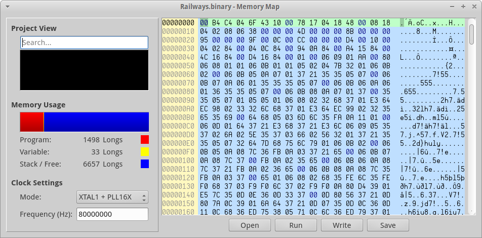
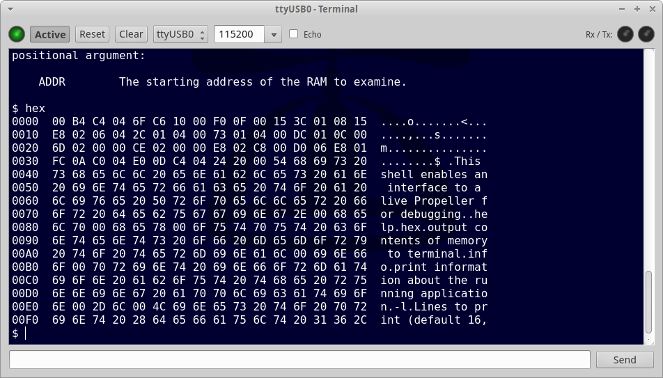
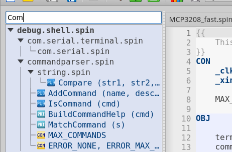
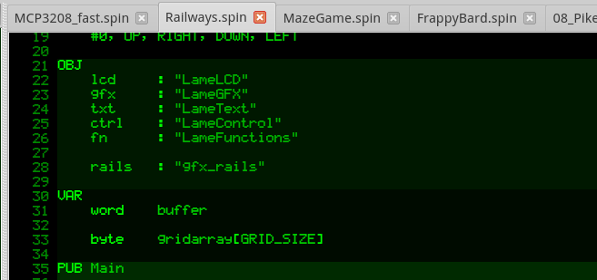

 

PropellerIDE is a fun, easy, beautiful editor for the Propeller microcontroller.

* Code the way you like with a colorful, customizable editor.
* Dig deeper into your applications with the built-in memory map.
* Speak your Propeller's language with the integrated serial terminal.
* Find what you need fast with searchable project view and auto-complete.
* Start coding right away with the included Spin Standard Library.
* Runs great on Windows, Mac, Linux, and Raspberry Pi!

## Screenshots

#### Main Window

#### Memory Map

#### Terminal

#### Project View

#### Indent Guides

#### Theming

## License

PropellerIDE is free software from end to end, licensed under the GPLv3.

## Feedback?

Contact the developers at `contact@lamestation.com`.
