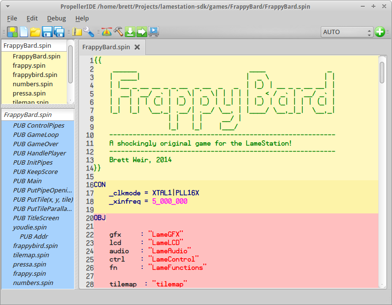

 PropellerIDE [](https://travis-ci.org/bweir/PropellerIDE)
============



PropellerIDE is an easy-to-use, cross-platform development tool for the Parallax Propeller microcontroller.

Write Spin code, download programs to your Propeller board, and debug your applications with the built-in serial terminal.

- [Download PropellerIDE](https://lamestation.atlassian.net/wiki/display/PI/Downloads)

### Features

- Spin syntax highlighting, auto-complete, code suggestion, and auto-indent
- Unicode editing support
- Auto-detection of connected Propeller hardware
- Collapsible sidebar with function and program views
- Integrated serial terminal

### Planned Features

- Unified tree view showing hierarchy of objects and functinos
- Integrated Spin and Assembly help manual
- Plugin interface for extending the application

PropellerIDE was created using C++ and Qt.

## Building


### Dependencies

PropellerIDE requires Qt5 to be installed on all platform. Windows packaging
requires Inno Setup 5 to be installed with preprocessor support. The build
and release tools require Python 2.7 to be installed.

### Targets

Type `make help` to see a list of available package targets.

```
$ make help
Usage:    make [TYPE]

Enter package type to build. Options:

   win    windows installer
   mac    mac bundle
   deb    debian package
   rpi    debian package for Raspberry Pi

   no parameter builds only the binaries
```

### Linux

Run an update to ensure your apt repositories are up-to-date.

```
sudo apt-get update
```

Install the required dependencies.

```
sudo apt-get install git make g++ qt5-default zlib1g-dev
```

Checkout the project.

```
git clone https://github.com/lamestation/PropellerIDE.git PropellerIDE
cd PropellerIDE
make checkout
```

Type `make deb` in the project root to build a Debian package.

```
make deb
```

Type `make clean` to remove old build files.

```
make clean
```

PropellerIDE is known to build on Ubuntu as far back as 12.04.

### Windows

PropellerIDE on Windows is built using the Qt5 MinGW distribution from Qt's website:

* http://qt-project.org/downloads

For development, the easiest way to get started building the project is through QtCreator. Open the `src/src.pro` file as a project in the editor and build. Shadowed builds are not currently supported.

PropellerIDE can also be built from the Windows PowerShell. This is how release builds and installers are produced. You will need to set the system path correctly.

```
C:\Qt\Tools\mingw482_32\bin;C:\Qt\5.3\mingw482_32\bin;C:\Program Files (x86)\Inno Setup 5
```

Open the PowerShell. The `make` command on Windows is `mingw32-make.exe`. Add the `win` parameter to build a Windows installer.

```
mingw32-make.exe checkout
mingw32-make.exe win
```

Add `clean` to clean up old build files.

```
mingw32-make.exe clean
```

PropellerIDE has been built on Windows 7 and 8.

*Note: QtCreator and command-line builds generate build files that are incompatible with each other, so you will need to call `make distclean` in the `src/` directory before you can switch from one to the other.*

### OS X

Install XCode through the App Store, then install the command-line tools through the terminal.

```
xcode-select --install
```

Type `make mac` to create an app bundle and DMG package for distribution.

```
make checkout
make mac
```

The Qt version used must match the XCode version. The easiest solution is to use the latest version of xcode and Qt.

### Raspberry Pi - Raspbian Wheezy

Qt5 is not available in the standard repository, but you can obtain it from Debian backports.

Add the following entries to `/etc/apt/sources.list`.

```
deb http://twolife.be/raspbian/ wheezy main backports
deb-src http://twolife.be/raspbian/ wheezy main backports
```

Add the repository key.

```
sudo apt-key adv --keyserver keyserver.ubuntu.com --recv-key 2578B775
```

Update and install Qt5 and its dependencies.

```
sudo apt-get update
sudo apt-get install qt5-default qt5-qmake libegl1-mesa libgles2-mesa
```

Finally, build a deb file as you would on Linux:

```
make checkout
make rpi
```

And install:

```
sudo dpkg -i staging/*armhf.deb
```

## Credits

Developed by LameStation LLC (contact@lamestation.com) in collaboration with Parallax Inc.

Originally developed by Steve Denson, Dennis Gately, and Roy Eltham.
