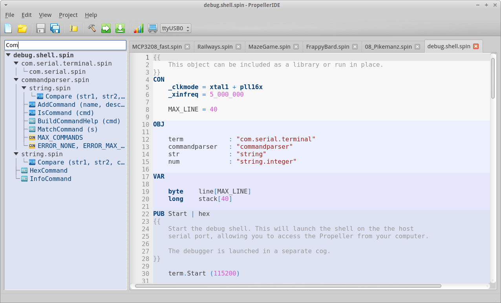

 

PropellerIDE is a fun, easy, beautiful editor for the Propeller microcontroller.

## Features

* Code the way you like with a colorful, customizable editor.
* Dig deeper into your applications with the built-in memory map.
* Speak your Propeller's language with the integrated serial terminal.
* Find what you need fast with searchable project view and auto-complete.
* Start coding right away with the included Spin Standard Library.
* Runs great on Windows, Mac, Linux, and Raspberry Pi!

## Documentation

The PropellerIDE manual is available online and print formats:

- Online: [HTML](https://bweir.gitbooks.io/PropellerIDE-docs/content/)
- Printable formats: [PDF](https://www.gitbook.com/download/pdf/book/bweir/PropellerIDE-docs) | [ePub](https://www.gitbook.com/download/epub/book/bweir/PropellerIDE-docs) | [Mobi](https://www.gitbook.com/download/mobi/book/bweir/PropellerIDE-docs)

## License

Copyright 2014-2016 by Parallax Inc. PropellerIDE is free software, licensed under the GPLv3. See [LICENSE](LICENSE) for more information.

## Feedback

PropellerIDE is developed for Parallax Inc. by LameStation LLC. Contact us at `contact@lamestation.com`.
