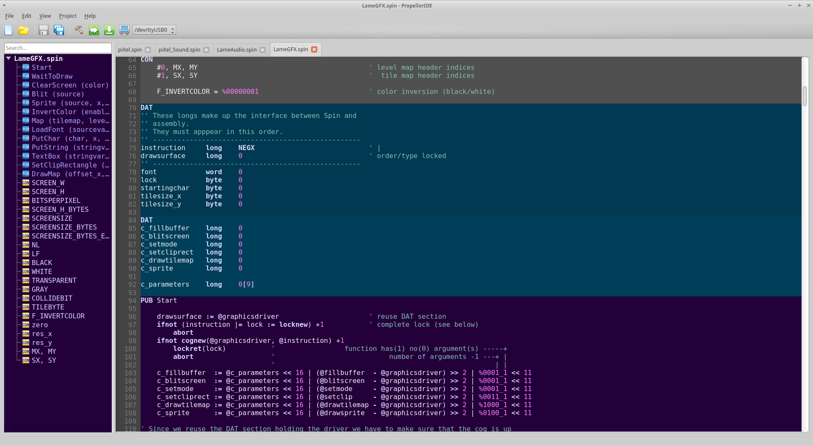

#  PropellerIDE
#### PropellerIDE is an easy-to-use, cross-platform development tool for the Parallax Propeller microcontroller.

[](https://travis-ci.org/parallaxinc/PropellerIDE) [](https://ci.appveyor.com/project/bweir/propelleride)




Write Spin code, download programs to your Propeller board, and debug your applications with the built-in serial terminal.

- [Download PropellerIDE](http://www.lamestation.com/propelleride)

## About

PropellerIDE is designed to be more than just a code editor; it is a toolkit for building custom Propeller development environments that can be tailored to specific applications. Written in C++ with Qt, PropellerIDE can be configured to support specific programming languages, toolchains, or features as first-class components that feel built-in and well-integrated to the customer, but are really standalone components.

### Features

- Spin syntax highlighting, auto-complete, and auto-indent
- Unicode editing support
- Searchable project view
- Serial terminal, memory map,
- Deep integration with Propeller hardware
- Customizable theming
- Runs on Windows, Mac, Linux, and Raspberry Pi!
- Easy to deploy for custom applications using `packthing`

### Project Roadmap

#### Immediate focus

* Improve overall code maintainability
* Refactor components for better separation of concerns
* Refactor widgets to use UI forms
* Auto-select newly attached serial devices

#### Long-term focus

* Multiple Propeller languages: Spin, C, PropBasic, xBasic, Forth,...
* Serial and wireless code download
* New platforms: Android, ChromeBook, HTML5, iOS
 
#### Requested features (short list)

* Alt-Drag to select text blocks
* Colorful serial console formatting
* Indent guides
* More Propeller documentation

#### Features to support LameStation

* Clean up compiler output and add directory support
* Integrated web help

## Dependencies

* PropellerIDE requires at least Qt5.2.
* Windows packaging requires Inno Setup 5 with preprocessor support. 
* Build and release tools require Python 2.7.
* You will need Git; on Windows, download Git Shell from GitHub.

## Build Environment

### Ubuntu

There is a bug in QSerialPortInfo that results in a memory leak in Qt5.2.1 on POSIX
systems. You will need a minimum of Qt5.3 which is only available on Ubuntu as of
14.10.

Add the Utopic Unicorn sources to your `/etc/apt/sources.list` if you are on 14.04
or earlier.

```
deb http://cz.archive.ubuntu.com/ubuntu utopic main 
```

Run an update to ensure your apt repositories are up-to-date.

```
sudo apt-get update
```

Install the required dependencies.

```
sudo apt-get install git make g++ qt5-default libqt5serialport5 zlib1g-dev libudev-dev
```

PropellerIDE release versions are made in Travis CI, which runs on Ubuntu 12.04. See the `.travis.yml` in this project to see how to build for that version of Ubuntu.

### Windows

PropellerIDE on Windows is built using the Qt5 MinGW distribution from Qt's website:

* https://www.qt.io/download/

```
C:\Qt\Tools\mingw482_32\bin;C:\Qt\5.3\mingw482_32\bin;C:\Program Files (x86)\Inno Setup 5
```

To build from the command line, and for release, use PowerShell. The `make` command on Windows is `mingw32-make.exe`. PropellerIDE has been built on Windows 7 and 8.

### OS X

Install XCode through the App Store, then install the command-line tools through the terminal.

```
xcode-select --install
```

The Qt version used must match the XCode version. The easiest solution is to use the latest version of XCode and Qt.

### Raspberry Pi - Raspbian Wheezy

Qt5 is not available in the standard repository, but you can obtain it from Debian backports.

Add the following entries to `/etc/apt/sources.list`.

```
deb http://twolife.be/raspbian/ wheezy main backports
deb-src http://twolife.be/raspbian/ wheezy main backports
```

Add the repository key.

```
sudo apt-key adv --keyserver keyserver.ubuntu.com --recv-key 2578B775
```

Update and install Qt5 and its dependencies.

```
sudo apt-get update
sudo apt-get install qt5-default qt5-qmake libegl1-mesa libgles2-mesa
```

## Building

PropellerIDE can be built from the command-line using `qmake` or from QtCreator. Shadowed builds are not currently supported.

*Note: QtCreator and command-line builds generate build files that are incompatible with each other, so you will need to call `make distclean` in the `src/` directory before you can switch from one to the other.*

First, checkout the project.

```
git clone https://github.com/lamestation/PropellerIDE.git PropellerIDE
cd PropellerIDE
```

Retrieve any dependencies.

``` 
git submodule update --init --recursive
```

Change to the source root and generate the makefiles.

```
cd src/
qmake -r
```

Then build the project.

```
make
```

Or on Windows,

```
mingw32-make
```

`make clean` to clean the project; `make distclean` to *really* clean it.

## Packaging For Release

Whereas old versions of PropellerIDE used a custom makefile, the current software is built using [`packthing`](https://github.com/lamestation/packthing), which is a free multi-source packaging tool by LameStation. Follow the link to learn more.

## Credits

Developed by LameStation LLC (contact@lamestation.com) in collaboration with Parallax Inc.

Originally developed by Steve Denson, Dennis Gately, and Roy Eltham.
